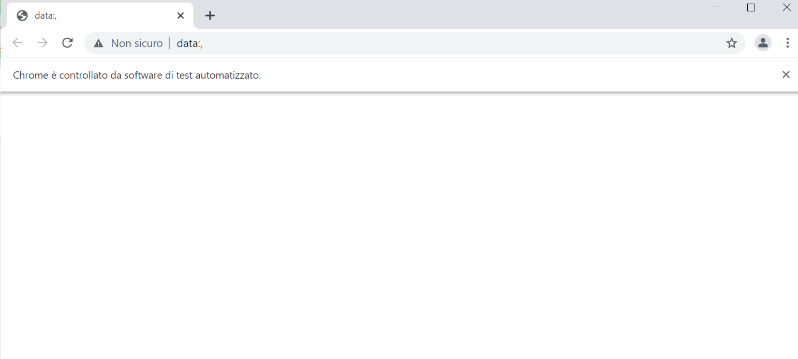
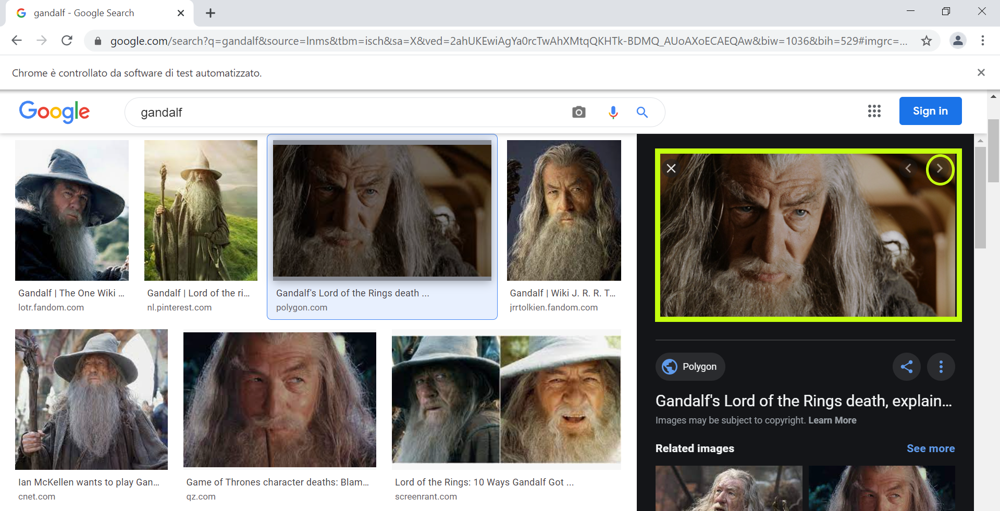
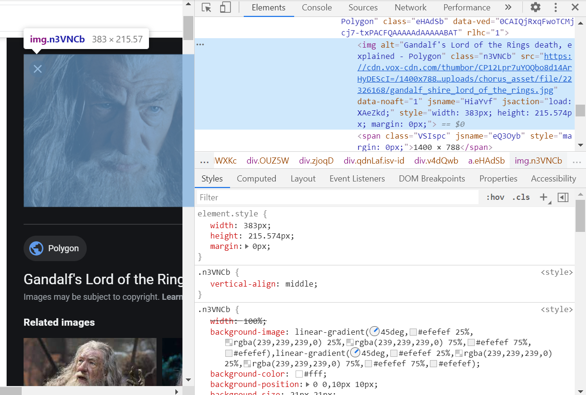

# _G-i[mage]-dowloader_
#### _Download Google images with Selenium and Python_
***
#### _*Introduction*_
In this Jupyter notebook we will setup a chrome driver. Given a Google image search page the script downloads the images related to that search in a specified folder. Follow the cells below for a full explanation of the code.

#### _Imports_

```python
#import necessary packages
from selenium import webdriver
from selenium.webdriver.common.keys import Keys
import os
import traceback
import requests
import time
```

#### _Start Chrome Session_
- Setup a Chrome driver session with selenium.
- the chromedriver file is supposed to be in the same directory of the notebook. Change it if needed.

```python
# setup a chrome driver and start a chrome session
driver_path = os.path.join(os.getcwd(),'chromedriver.exe')
chrome_options = webdriver.ChromeOptions()
chrome_options.add_experimental_option('prefs', {'intl.accept_languages': 'en,en_US'})
driver = webdriver.Chrome(driver_path,options=chrome_options)
```

if everything went well a chrome browser was opened, just like in the image below.
***


***
#### _Search the image needed_
Now you can perform your search, like the one in the image below.
***


***

Note that there are two elements highlighted in green. **_It is mandatory that those elements are visible_** during the download phase, because Selenium will interact with:
* the image to download it
* the chevron right icon to go to the next image

#### _HTML structure of the page_
we can inspect the html structure of an element by right-clicking and selecting "Inspect". A navigation with the code will appear on the right.
***


***
we are interested in the `````` tag and ```class``` attribute.

For demonstration purposes you can run the cell below. Selenium will search for all the elements with ```tag="img"``` and ```class="n3VNCb"``` and store the ```src``` attribute in a list.

```python
img_html_class="n3VNCb"
#find Image
img=[im.get_attribute('src') for im in driver.find_elements_by_css_selector('img') if im.get_attribute("class")==img_html_class]
print("I found {} images with the same class".format(len(img)))
```

This is because the html structure of the page is so that the selected image, the previous one and the next one are all stored with the same tag and class. How to find it? trial and fail. I tried to dowload each of them and found out the structure. This is sometimes needed when scraping with Selenium or other libraries.

In conclusion, the list is organized in this way ```[previous image,target image,next image]```, so that we should always select the ```[1]``` component to get our target image.

The same applies to the chevron right icon we will use to go to next, with the difference that now ```tag="a"``` and ```class="gvi3cf"```.

#### *Configuring*
Knowing this we can configure some variables and function.

```python
# classes for image and button html elements
img_html_class="n3VNCb
btn_html_class="gvi3cf"

# number of images to dowload
nimages_to_download=1

# folder where to save the images
# default: current directory 
image_folder = os.path.join(os.getcwd())
```

A function to parse the ```src``` attribute of the image. We remove unwanted characters and check if the name contains the ```.jpg``` or ```.png``` extension. We also use the attribute to perform an ```http request```.

```python
def get_image_and_reponse(src):
    # parse the src name
    # remove / and ? and build the complete destination
    # save only valid image formats
    imageout=os.path.join(image_folder,src.split('/')[-1].split('?')[0])
    imageout=imageout if ".jpg" in i mageout or ".png" in imageout else None
    
    # get the response 
    reponse = requests.get(src,timeout=5)
   
    return (response, imageout)
 ```
 
 a function to write the reponse content to disk (perform the actual image download).

```python
 def save_to_file(reponse,image_out):
    with open(imageout,"wb") as file:
        # save reponse content to file
        file.write(reponse.content)
    return
```

#### _Wrap everything in a loop and start dowloading_
when then start an infinite loop trying to:
* find the image and save it to file
* find the next button and click it

we break the loop in case of maximum number of images dowload or if we arrive at the bottom of the page (the next button is not clickable anymore).

```python
# initialize image counter
count=1

# start an infinite loop
while True:
    #find Image
    time.sleep(1)
    img=[im.get_attribute('src') for im in driver.find_elements_by_css_selector('img') if im.get_attribute("class")==img_html_class]

    try:
        # get reponse and imagename
        (reponse, imageout) = get_image_and_reposnse(img[1])
        
        # if ok we save it to file
        if imageout and reponse.status_code == 200: 
            save_to_file(reponse,imageout)
            count+=1
    except:
        print("there was a problem in dowloading the image. Here is the traceback")
        traceback.print_exc()
        
    #Find Next Button and try to click it       
    btn=[im for im in driver.find_elements_by_css_selector('a') if im.get_attribute("class")==btn_html_class]
    try:
        btn[1].click()
    except:
        print("There was a problem during clicking Next button. Here is the traceback")
        traceback.print_exc()
        #need to break to avoid geeting stuck in loop when arriving at the last image
        break
    
    # break loop if the desired number of images
    # is been dowloaded
    if count==nimages_to_download:break
```
